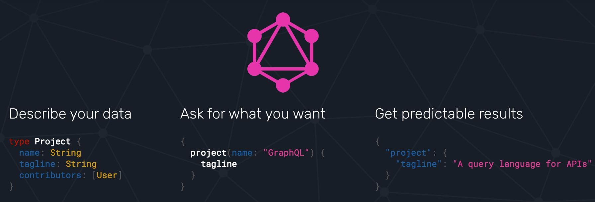
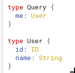

# GraphQL  

* What is GraphQL - is a  query  language for [API](https://www.mulesoft.com/resources/api/what-is-an-api), GraphQL isn't tied to any specific database or storage engine and is instead backed by your existing code and data.

* How to Works - A GraphQL service is created by defining types and fields on those types, then providing functions for each field on each type, for exemplo: 

[Learn about GraphQL](https://graphql.org/learn/)

